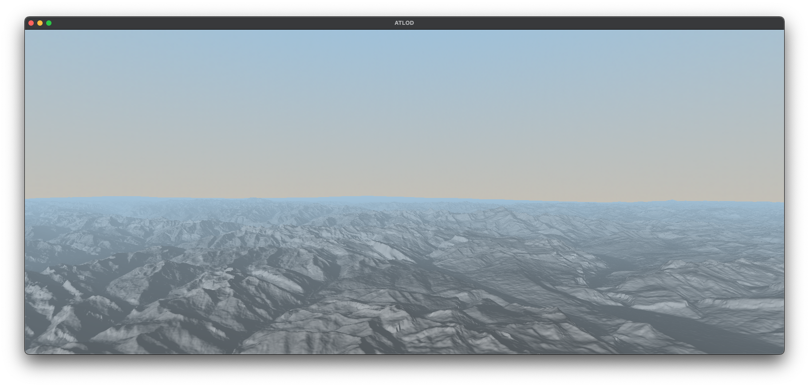

# 3d-terrain-level-of-detail
A small terrain renderer with level of detail (LOD), developed as part of the module "Project 2" at the Bern University of Applied Sciences



## Introduction
Rendering terrains is an important task in various practical applications of 
computer graphics, such as video games, GIS and simulation systems. 
Due to the sheer size and constant visibility of terrains, optimizations are necessary 
for rendering them efficiently, one of which is the *LOD (level of detail)*.
In this project, I mainly researched and compared existing terrain LOD
algorithms and approaches and evaluated them based on their suitability for implementation.
Based on my findings, I developed a small demo terrain renderer (named ATLOD),
which is mainly based on a mix between GeoMipMapping (W. H. de Boer, 2000) and 
GPU-based Geometry Clipmaps (H. Hoppe and A. Asirvatham, 2005), but also 
incorporates elements form other approaches.

## Repository Structure
This repository is structured as follows:

- [`src`](src): contains the source code of ATLOD, the terrain LOD demo application written in C++ and OpenGL
- [`lib`](lib): contains libraries in form of Git submodules
- [`data`](data): contains data relevant for ATLOD, such as heightmaps, overlay textures and skyboxes (explained in greater detail below)
- [`report`](report): contains the LaTeX source code of the project report
- [`research`](research): contains relevant research publications on terrain LOD (mainly for learning about the various approaches)
- [`scripts`](scripts): contains helper scripts

## Used APIs, Tools and Libraries
- C++ 17
- OpenGL 3.3
- CMake
- GLEW
- GLFW
- GLM
- Dear ImGui
- stb_image.h

## Building
### Linux and Mac OS
```plaintext
# 1. Clone repository and submodules from GitHub
git clone --recursive https://github.com/AmarTabakovic/3d-terrain-with-lod.git

# 2. Change into the repository directory
cd 3d-terrain-with-lod

# 3. Create build folder and change into it
mkdir build
cd build

# 4. Run CMake
cmake ..

# 5. Build with make
make
```

### Windows
```plaintext
# 1. Clone repository and submodules from GitHub
git clone --recursive https://github.com/AmarTabakovic/3d-terrain-with-lod.git

# 2. Change into the repository directory
cd 3d-terrain-with-lod

# 3. Create build folder and change into it
mkdir build
cd build

# 4. Run CMake
cmake ..
```

Afterwards, you can open the `.sln` file in Visual Studio.

### Running
#### Usage
The `data` folder is organized in a special way:
```plaintext
└── data
    ├── heightmaps
    ├── overlays
    └── skybox
```

ATLOD supports heightmaps 16-bit grayscale PNG images. The maximum heightmap size depends on the system 
(usually either 8k x 8k or 16k x 16k).
All heightmap image files must be located in `heightmaps`, all overlay texture files must located be in `overlays`
and all skybox folders must be located in `skybox`. 
The folder containing a specific skybox 
must contain six images stored as `front.png`, `back.png`, `left.png`, `right.png`, `top.png`, `bottom.png`.
See the default skybox folder as an example.

ATLOD requires some command line arguments, which can either be passed directly 
in the command line, or set in the IDE.

The following arguments are mandatory:
- Data folder path: `--data_folder_path=<string>`
- Heightmap filename (only the filename, not the full path): `--heightmap_file_name=<string>`

The following arguments can be passed optionally:
- Block size (for GeoMipMapping, must be of the form $2^n + 1$ for some $n$): `--block_size=<int>` (default 257)
- Minimum LOD (for GeoMipMapping, is always bounds-checked with min()): `--min_lod=<int>`
- Maximum LOD (for GeoMipMapping, is always bounds-checked with max()): `--max_lod=<int>`
- Overlay texture file name: `--overlay_file_name=<string>` (default none)
- Skybox folder name: `--skybox_folder_name=<string>` (default "simple-gradient")
- Load GeoMipMapping: `--geomipmapping=<0 or 1>` (default 1)
- Load naive rendering: `--naive_rendering=<0 or 1>` (default 0)

**Important**: the passed paths cannot contain any spaces and the arguments cannot contain spaces between the `=` symbol.

Example usage (Linux and Mac OS):
```plaintext
./atlod --data_folder_path=../data --heightmap_file_name=6k-x-6k-heightmap.png --geomipmapping=1 --naive_rendering=0
```

#### Keyboard 
- `WASD`: Movement
- Arrow keys: Look around
- `O`: Toggle options windows
- `L`: Set light direction to current direction
- `F`: Start automatic camera flying
- `R`: Start automatic 360-degree camera rotation
- `Esc`: Quit

## Generating Custom Heightmaps
Heightmaps can be converted from GeoTIFF or Esri ASCII grids into 16-bit grayscale PNG images using QGIS.
Perform the following steps:
1. Open the GeoTIFF or ASCII grid file with QGIS
2. Select "Raster" -> "Conversion" -> "Translate (Convert Format)..."
3. Select your heightmap as the input layer
4. "Output data type": UInt16
5. "Converted": enter the path for your new heightmap, but with ".png" at the end
6. Move your newly generated heightmap file to the `data/heightmaps` folder as described above

# License

[MIT License](LICENSE)
